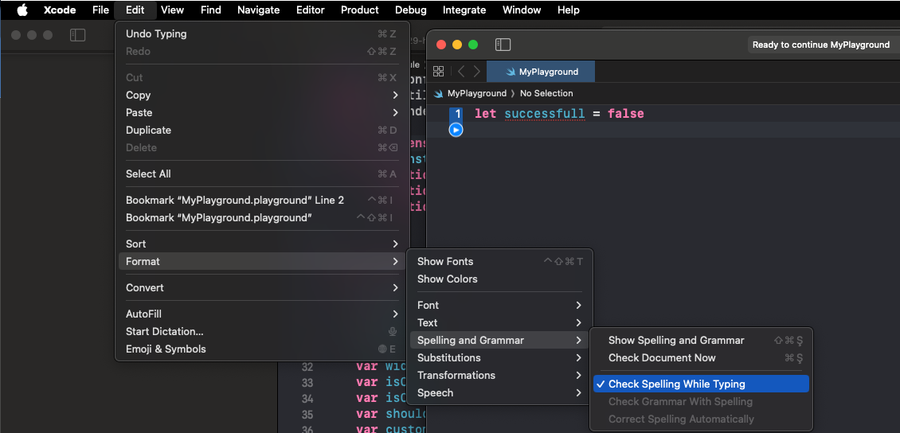
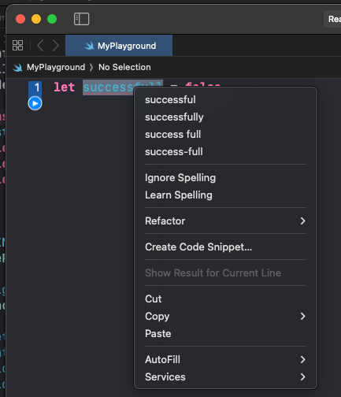
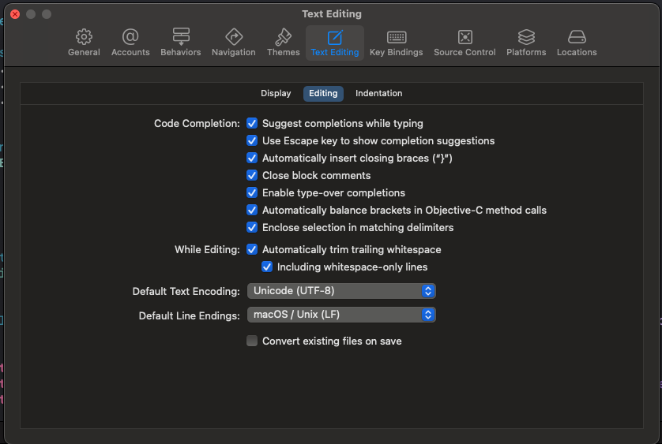
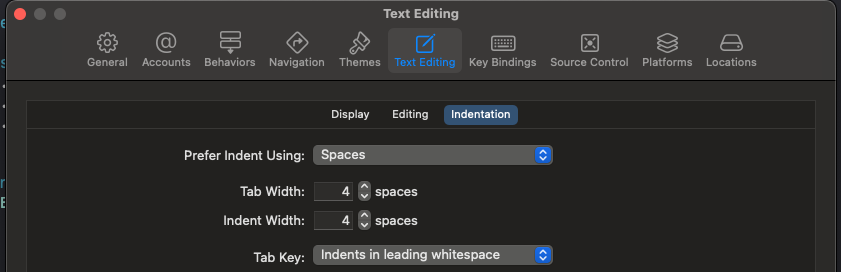

# Trendyol iOS Style Guide

Tailored exclusively for the Trendyol app, this Swift Style Guide prioritizes code readability within Trendyol's unique development environment. Crafted to ensure consistency across diverse contributors, the guide serves as a dedicated resource for maintaining a cohesive and clear codebase.

Our overarching goals are clarity, consistency and brevity, in that order.

## Table of Contents

* [Using SwiftLint](#using-swiftlint)
* [Unit Tests](#unit-tests)
* [Function And Variable Declarations For Page Guide](#function-and-variable-declarations-for-page-guide)
* [Naming](#naming)
  * [Variables](#variables)
  * [Methods](#methods)
  * [Delegates](#delegates)
  * [Interface](#interface)
  * [Generics](#generics)
  * [Loops](#loops)
  * [Self and self usage](#self-and-self-usage)
  * [Class and Structs](#class-and-structs)
  * [Attributes](#attributes) 
  * [Language](#language) 
  * [String Concatenation](#string-concatenation)
* [File Organization](#file-organization)
* [Code Organization](#code-organization)
  * [Protocol Conformance](#protocol-conformance)
  * [Unused Code](#unused-code)
  * [Omitting Return](#omitting-return)
  * [Imports](#imports)
* [Spacing & New Line](#spacing-and-new-line)
* [Parentheses & Braces](#parentheses-&-braces)
* [Comments](#comments)
* [Final Usage](#final-usage)
* [High Order Functions](#high-order-functions)
* [Closures](#closures)
* [Tuples](#tuples)
* [Property Observers](#property-observers)
* [Types](#types)
  * [Init Usage](#init-usage)
  * [Constants](#constants)
  * [Enums](#enums)
  * [Typealiases](#typealiases)
  * [Type Inference](#type-inference)
* [Access Control](#access-control)
* [Control Flow](#control-flow)
  * [Ternary Operator](#ternary-operator)
  * [Else Statements](#else-statements)
  * [Switch Statements](#switch-statements)
  * [Golden Path](#golden-path)
* [Multi-line String Literals](#multi-line-string-literals)
* [Pre-processor Directives](#pre-processor-directives)
* [References](#references)

## Unit Tests
The rules do not apply to unit tests at the moment unless it's explicitly stated that the rule is valid for unit tests too. After the document reaches a certain maturity, separate work will be done for unit testing.

## Using SwiftLint

When developing for Trendyol, it is highly recommended — and may even be mandatory, depending on your team — to incorporate our SwiftLint configuration. Please refer to the [SwiftLint Policy](SWIFTLINT.markdown) for detailed information.,

## Function And Variable Declarations For Page Guide

You can read the [document here](function_Declarations_examples.md), which includes examples to make function and variable definitions more readable and understandable.

## Naming

Descriptive and consistent naming makes software easier to read and understand. Use the Swift naming conventions described in the [API Design Guidelines](https://swift.org/documentation/api-design-guidelines/). Some key takeaways include:

- striving for clarity at the call site
- prioritizing clarity over brevity
- using `camelCase` (not `snake_case`)
- using `UpperCamelCase` for types and protocols, `lowerCamelCase` for everything else
- including all needed words while omitting needless words
- using names based on roles, not types
- sometimes compensating for weak type information
- striving for fluent usage
- beginning factory methods with `make`
- naming methods for their side effects
  - verb methods follow the -ed, -ing rule for the non-mutating version
  - noun methods follow the formX rule for the mutating version
  - boolean types should read like assertions
  - protocols that describe _what something is_ should read as nouns
  - protocols that describe _a capability_ should end in _-able_ or _-ible_
- omitting all labels when arguments can't be usefully distinguished _e.g. min(number1, number2), zip(sequence1, sequence2)_
- using terms that don't surprise experts or confuse beginners
- generally avoiding abbreviations
- using precedent for names
- preferring methods and properties to free functions
- casing acronyms and initialisms uniformly up or down
- giving the same base name to methods that share the same meaning
- avoiding overloads on return type
- choosing good parameter names that serve as documentation
- preferring to name the first parameter instead of including its name in the method name, except as mentioned under Delegates
- labeling closure and tuple parameters
- taking advantage of default parameters
---
### Variables
#### 1. Booleans
Use one the **is**, **has** or **should** etc. prefixes to name a boolean to makes it clear that it is boolean and not other type.

**Preferred**:
```swift
 let isAddressAvailable = false
 let hasPermissionChanged = true
```

**Not Preferred**:
```swift
let permissionChanged = false
let isProductHasContent = false
```

#### 2. Declaration
Variable declaration should be lowerCamelCase.

#### 3. Type Inference
Don't include type information.

**Preferred**:
```swift
let screenName = ""
let presenter = ScreenPresenter()
```

**Not Preferred**:
```swift
let screenName: String = ""
let presenter: ScreenPresenter = ScreenPresenter()
```

There might be some exceptions, like array and floating number declarations when explicitly needed.

```swift
let products: [Product] = []
let products: [Product] = .empty
let buttonOpacity: CGFloat = 1
```

#### 4. Let vs var
Always use let over var for immutable variables.

#### 5. Avoid Ambiguity
Name variables according to their roles, rather than their types. Include all the words needed to avoid ambiguity for a person reading code where the name is used. 

**Preferred**:
```swift
@IBOutlet private weak var iconImageView: UIImageView!
let isLowestPriceDurationActive = false
let greetingText = "Hello Trendyol!"
```

**Not Preferred**:
```swift
@IBOutlet private weak var icon: UIImageView!
let isDurationActive = false
let text = "Hello Trendyol!"
```

#### 6. Naming from general part to specific part
Order names by starting with the most general part and ending with the most specific part.

**Preferred**:
```swift
let borderRadius: CGFloat
let bodyMarginRight: CGFloat
```

**Not Preferred**:
```swift
let radiusBorder: CGFloat
let bodyRightMargin: CGFloat
```

#### 7. Underscore Usage
Don't use underscore.

**Preferred**:
```swift
let array: [String] = []
let filteredArray: [String] = []
```

**Not Preferred**:
```swift
let array: [String] = []
let _array: [String] = []
```

#### 8. Static Properties
Static properties returning instances of their declaring type are not suffixed with the type's name.

**Preferred**:
```swift
enum Constant {
    enum InstallmentView {
        static let backgroundColor: UIColor
        static let cornerRadius: CGFloat
        static let borderWidth: Double
    }
}
```

**Not Preferred**:
```swift
enum Constant {
    static let installmentViewBackgroundColor: UIColor
    static let installmentViewCornerRadius: CGFloat
    static let installmentViewBorderWidth: Double
}
```

#### 9. Proper Nouns
Use lowercased naming if noun is being used as prefix, otherwise it should be uppercased.

**Preferred**:
```swift
 var utf8Bytes: [UTF8.CodeUnit]
 var endpointURL: URL
 var userSMTPServer: SecureSMTPServer
```

**Not Preferred**:
```swift
 var endpointUrl: URL
 var userSmtpServer: SecureSMTPServer
```

#### 10. Computed Properties
Naming should be just like ordinary variable, not like functions.

**Preferred**:
```swift
var productDetailDescriptionText: String {
    ...
}
```

**Not Preferred**:
```swift
var makeProductDetailDescriptionText: String {
    ...
}
```
---
### Methods

Method Naming for Non-Side-Effect Functions:

Methods that do not cause side effects should be named using the form of a question. For example:

```swift
let size = view.originalSize()
```
Method Naming for Side-Effect Functions:

Methods that perform actions and cause side effects should be named using imperative verbs. For instance:

```swift
list.sort()
```

Naming Non-Mutating Methods:

Methods that do not modify the original object but return a new value should be named using the past participle or present participle. Examples include:

```swift
let newList = oldList.sorted()
let newList = oldList.sortingLexicographically()
```

Parameter Naming Convention:

Parameter names should follow the same conventions as variable names. Utilize Swift’s syntax to ensure the method declaration reads naturally, almost like a sentence. For example:

```swift
func insert(_ element: Element, at index: Int)
```

should be read as:

```swift
insert(someElement, at: someIndex)
```

Factory Method Naming:

Factory method names should start with the word “make”. Both factory methods and initializers should list their parameters, but they are not required to form phrases.

**Preferred**:
```swift
init(name: String, id: Int)
func makeView(position: CGPoint, size: CGSize) -> UIView
```

**Not Preferred**:
```swift
init(withName name: String, andID id: Int)
```

**Naming UIControl Actions:**

UIControl actions should be named starting with the control's name followed by the word "tapped":

**Preferred**:
```swift
@objc
private func nextButtonTapped(_ sender: UIButton) {
    // ...
}
```

**Not Preferred**:
```swift
@objc
private func nextButtonAction(_ sender: UIButton) {
    // ...
}
```

Omitting Unused Parameters:

Avoid including parameters that are not used within the function.

**Preferred**:
```swift
func calculateSum(_ a: Int, _ b: Int) -> Int {
    return a + b
}
```

**Not Preferred**:
```swift
func calculateSum(_ a: Int, _ b: Int, _ c: Int) -> Int {
    return a + b  // The parameter 'c' is unused
}
```

Omitting Void Return Types:

Do not include Void in the return type of function definitions.

**Preferred**:
```swift
func performTask() {
    // Implementation
}
```

**Not Preferred**:
```swift
func performTask() -> Void {
    // Implementation
}
```

Command-Query Separation Principle:

When a function’s return value might be useful in certain scenarios but is not always needed, use the @discardableResult annotation. However, this practice is generally discouraged. Follow the [command-query separation](https://en.wikipedia.org/wiki/Command–query_separation) principle to keep functions focused on either performing an action or returning data, but not both.

---

### Delegates

Delegate protocols and delegate-like protocols (such as data sources) should use a specific naming convention inspired by Cocoa’s protocols.

> The "delegate's source object" refers to the object that calls the delegate methods. For instance, a `UITableView` is the source object that calls methods on the `UITableViewDelegate` set as its `delegate` property.

All delegate methods should take the delegate’s source object as their first parameter.

For methods where the delegate’s source object is the **only** parameter:

-   If the method returns `Void` (typically used to notify the delegate of an event), the method name should start with the **delegate’s source type** followed by an **indicative verb phrase** describing the event. This parameter should be **unlabeled**.
    
    ```swift
    func scrollViewDidBeginScrolling(_ scrollView: UIScrollView)
    ```
    
-   If the method returns `Bool` (often used to ask a yes/no question about the delegate’s source object), the method name should start with the **delegate’s source type** followed by an **indicative or conditional verb phrase** describing the question. This parameter should be **unlabeled**.
    
    ```swift
    func scrollViewShouldScrollToTop(_ scrollView: UIScrollView) -> Bool
    ```
    
-   If the method returns a value other than `Void` or `Bool` (typically used to request information about the delegate’s source object), the method name should be a **noun phrase** describing the requested information. This parameter should be **labeled with a preposition or phrase with a trailing preposition** to clearly link the noun phrase and the delegate’s source object.
    
    ```swift
    func numberOfSections(in scrollView: UIScrollView) -> Int
    ```
    
For methods that take **additional** parameters after the delegate’s source object, the method name should start with the delegate’s source type **by itself** and the first parameter should be **unlabeled**. Then:

-   If the method returns `Void`, the second parameter should be **labeled with an indicative verb phrase** describing the event that the parameter represents as its **direct object or prepositional object**, with any other parameters providing further context.
    
    ```swift
    func tableView(_ tableView: UITableView,
                   willDisplayCell cell: UITableViewCell,
                   forRowAt indexPath: IndexPath)
    ```
    
-   If the method returns `Bool`, the second parameter should be **labeled with an indicative or conditional verb phrase** that describes the return value in terms of the parameter, with any other parameters providing further context.
    
    ```swift
    func tableView(_ tableView: UITableView,
                   shouldSpringLoadRowAt indexPath: IndexPath,
                   with context: UISpringLoadedInteractionContext) -> Bool
    ```
    
-   If the method returns a value other than `Void` or `Bool`, the second parameter should be **labeled with a noun phrase and trailing preposition** that describes the return value in terms of the parameter, with any other parameters providing further context.
    
    ```swift
    func tableView(_ tableView: UITableView,
                   heightForRowAt indexPath: IndexPath) -> CGFloat
    ```

Apple’s [documentation on delegates and data sources](https://developer.apple.com/library/content/documentation/General/Conceptual/CocoaEncyclopedia/DelegatesandDataSources/DelegatesandDataSources.html) provides further guidance on naming conventions for these methods.

#### Examples:
**Preferred**:
```swift
func namePickerView(_ namePickerView: NamePickerView, didSelectName name: String)
func namePickerViewShouldReload(_ namePickerView: NamePickerView) -> Bool
func namePickerViewNumberOfSections(in scrollView: UIScrollView) -> Int
func namePickerViewRefreshOrdersAndFocus(on orderParentId: String)
```

**Not Preferred**:
```swift
func didSelectName(namePicker: NamePickerViewController, name: String)
func namePickerShouldReload() -> Bool
func numberOfSections(scrollView: UIScrollView) -> Int
func viewRefreshOrdersAndFocus(on orderParentId: String)
```
---

### Interface

Classes and structures should be named using noun phrases, similar to protocols that define what an object is. Protocols that add capabilities should be named descriptively (e.g., `Sortable`). Avoid ending protocol names with the word `Protocol`. Instead, conforming types should include a descriptive word in the name followed by the `Interface` suffix.

**Preferred**:
```swift
protocol EngineInterface { }
struct DefaultEngine: EngineInterface { }
protocol AccountRouterInterface { }
struct AccountRouter: AccountRouterInterface { }
private let router: AccountRouterInterface
```
**Not Preferred**:
```swift
protocol EngineProtocol { }
struct Engine: EngineProtocol { }
protocol AccountRouter { }
protocol AccountRouterProtocol { }
private let router: AccountRouter
```
Support for using the `AnyObject` keyword as a protocol constraint has been introduced, and it is recommended to prefer `AnyObject` over `class`.

> This proposal consolidates the concepts of `class` and `AnyObject`, which now both denote an existential for classes. To streamline this, the proposal suggests retaining only `AnyObject`. To minimize source-breaking changes, `class` could be redefined as `typealias class = AnyObject`, with `class` receiving a deprecation warning in the initial Swift version implementing this proposal. Eventually, `class` could be phased out in a future Swift release.

**Preferred**:
```swift
protocol FooInterface: AnyObject { }
```

**Not Preferred**:
```swift
protocol FooInterface: class { }
```
---

### Generics

Generic type parameters should be descriptive and use upper camel case naming. If the type doesn't have a specific role or relationship, use a traditional single uppercase letter like `T`, `U`, or `V`.

**Preferred**:
```swift
struct Container<Item> { ... }
func save<DataType: Encodable>(data: DataType)
func compare<T>(_ first: T, _ second: T) -> Bool
```


**Not Preferred**:
```swift
struct Container<T> { ... }
func save<datatype: Encodable>(data: datatype)
func compare<Element>(_ first: Element, _ second: Element) -> Bool
```
---

### Loops
#### 1. Where Clause
Prefer to use where clause if it's possible.

**Preferred**:
```swift
for item in items where item.productCount > 1 {
    ...
}
```

**Not Preferred**:
```swift
for item in items {
    if item.productCount > 1 {
       ...  
    }
}
```

#### 2. Indices
Use .indicies property to loop over array indexes.

**Preferred**:
```swift
for index in array.indices {
    ...
}
```

**Not Preferred**:
```swift
for index in 0..<array.count {
    ...
}
```

#### 3. Enumarated
Use .enumarated to loop through both index and item.

```swift
for (index, item) in array.enumarated() {
    ...
}
```

## Self and self usage

#### 1. Bind to self
Bind to self when capturing weak self reference.

 **Preferred**:
```swift
 func fetch(completion: () -> Void) {
   networkManager.request() { [weak self] response in
     guard let self else { return }
     self.bar()
     self.foo()
   }
 }
```

#### 2. Bind to self
Prefer using guard self checking unless you have single self usage. If you bind to self, don't use self again in the rest of the closure.

 **Preferred**:
```swift

 func fetch(completion: () -> Void) {
     networkManager.request { [weak self] response in
         guard let self else { return }
         bark()
         foo()
     }
 }

 func fetch(completion: () -> Void) {
     networkManager.request { [weak self] response in
         self?.bark()
     }
 }

 func fetch(completion: () -> Void) {
     networkManager..request() { [weak self] response in.
         guard let self else { return }
         bark(item, item2)
     }
 }
```

 **Not Preferred**:
```swift
 func fetch(completion: () -> Void) {
     networkManager..request { [weak self] response in
         guard let self else { return }
         bark()
     }
 }

 func fetch(completion: () -> Void) {
     networkManager..request { [weak self] response in
         self?.foo()
         self?.bark()
     }
 }

 func fetch(completion: () -> Void) {
     networkManager.request { [weak self] response in.
         self?.bark(self?.item, self?.item2)
     }
 }
```

#### 3. Unnecesary self usage
Use self only if you need it explicitly.

#### 4. Self usage
Prefer to use "Self" over concrete type name.

 **Preferred**:
```swift
 final class HomePageBarButtonsBuilder {
     private var buttons: [UIBarButtonItem] = []

     @discardableResult
     func appendSellerNotificationButton(target: Any?, selector: Selector) -> Self {
         ...
         return self
     }

     @discardableResult
     func appendSpacerButton(width: CGFloat) -> Self {
         ...
         return self
     }

     func build() -> [UIBarButtonItem] {
         return buttons
     }
 }

 protocol SomeProtocol {
     static func createModule() -> Self
 }
```
---
### Class and Structs
#### 1. Controller Suffix
Don't use "Controller" in names of classes that aren't view controllers.

#### 2. Declaration
Use PascalCase for type names.

#### 3. Mock Naming
Use "Mock" prefix for entire mock classes. 

**Preferred**:
```swift
class MockPriceView: PriceViewInterface { }
```

**Not Preferred**:
```swift
class PriceView: PriceViewInterface { }
class MockPriceViewInterface: PriceViewInterface { }
class MockPriceViewController: PriceViewInterface { } 
```

"Mock" prefix should be first rather than channel prefixes.

**Preferred**:
```swift
class MockPDPTagView: PriceViewInterface { }
```

**Not Preferred**:
```swift
class PDPMockTagView: PriceViewInterface { }
```

#### 4. Test Class Naming
Use "Tests" suffix for BaseXCTestCases.

#### 5. UI Related Class Naming
Use type constraint as suffix.

**Preferred**:
```swift
class INTPriceView: UIView { }
class INTDescriptionCell: UICollectionViewCell { }
```

**Not Preferred**:
```swift
class INTPriceComponent: UIView { }
class INTDescriptionComponent: UICollectionViewCell { }
```

#### 6. Version Suffixes
Use "V" suffix for versions of the classes. 

**Preferred**:
```swift
class ProductSliderCell { }
class ProductSliderCellV2 { }
class ProductSliderCellV3 { }
```

**Not Preferred**:
```swift
class ProductSliderCell { }
class ProductSliderCellNew { }
class ProductSliderCellRedesign { }
```
---

### Attributes

#### 1. Attribute Placement
Prefer to declare attribute in the same line if it's stored property, otherwise declare it in one line above. As exception, IBAction is declared in the same line by Xcode, you don't need to change it.

**Preferred**:
```swift
@objc 
class Manager {
    @State private var isLoggedIn = false
    
    @discardableResult
    func reset() {
      ...
    }
    
    @IBAction func logout() {
        ...
    }
    
    @IBAction
    func login() {
      ...
    }
}
```

**Not Preferred**:
```swift
@objc class Manager {
    @State
    private var isLoggedIn = false
    
    @discardableResult func reset() {
      ...
    }
}
```
---
### Language

Apply US English spelling to align with Apple's API.

**Preferred**:
```swift
let color = "red"
```

**Not Preferred**:
```swift
let colour = "red"
```

***Some tips***:

 if you turn on **"Check spelling while you type"**, found in the **Edit**->**Format**->**Spelling and Grammar** menu, Xcode will display the red word spelled wrong indicator for comments as they are spelled wrong. It will also spell check camel case identifiers



Also, you can look for the correct form via right-click



---
### String Concatenation

#### 1. String(format:) usage
Prefer "\()" over String(format:).

**Preferred**:
```swift
return "user name: \(user.name), user id: \(user.id), user height: \(length)"
```

**Not Preferred**:
```swift
return String(format: "user name: %@, user id: %d, user height: %f", user.name,  user.id, length)
```

## File Organization

**Alphabetize and deduplicate module imports within a file. Place all imports at the top of the file below the header comments. (Also see [Imports](#imports).)**

*Limit consecutive whitespace to one blank line or space (excluding indentation)*

**Preferred**:
```swift
struct Planet {
  let mass: Double
  let hasAtmosphere: Bool

  func distance(to: Planet) { }
}
```
**Not Preferred**:
```swift
struct Planet {
  let mass:          Double
  let hasAtmosphere: Bool


  func distance(to: Planet) { }
}
```

**Declarations that include scopes spanning multiple lines should be separated from adjacent declarations in the same scope by a newline.**

Insert a single blank line between multi-line scoped declarations (e.g. types, extensions, functions, computed properties, etc.) and other declarations at the same indentation level.

**Why**: Dividing scoped declarations from other declarations at the same scope visually separates them, making adjacent declarations easier to differentiate from the scoped declaration.

**Preferred**:
```swift
struct SolarSystem {
  var numberOfPlanets: Int {
    …
  }

  func distance(to: SolarSystem) -> AstronomicalUnit {
    …
  }
}

struct Galaxy {
  func distance(to: Galaxy) -> AstronomicalUnit {
    …
  }

  func contains(_ solarSystem: SolarSystem) -> Bool {
    …
  }
}
```
**Not Preferred**:
```swift
struct SolarSystem {
  var numberOfPlanets: Int {
    …
  }
  func distance(to: SolarSystem) -> AstronomicalUnit {
    …
  }
}
struct Galaxy {
  func distance(to: Galaxy) -> AstronomicalUnit {
    …
  }
  func contains(_ solarSystem: SolarSystem) -> Bool {
    …
  }
}
``` 

**Remove blank lines at the top and bottom of scopes, excluding type bodies which can optionally include blank lines.**

**Preferred**:
```swift
class Planet {
  func terraform() {
    generateAtmosphere()
    generateOceans()
  }
}
```
**Not Preferred**:
```swift
class Planet {
  func terraform() {

    generateAtmosphere()
    generateOceans()

  }
}
``` 

**Within each top-level section, place content in the following order. This allows a new reader of your code to more easily find what they are looking for.**

* Nested types and type aliases
* Static properties
* Class properties
* IBOutlet properties
* Instance properties
* Lifecycle methods
* Static methods
* Class methods
* IBAction methods
* Instance methods

**Protocol conforms should be ordered for understanding action structure easily.**

* Private method extension
* Type protocol conform extension
* Delegate conform extension
* Output conform extension

**Add empty lines between property declarations of different kinds. (e.g. between static properties and instance properties.)**

**Preferred**:
```swift
static let gravityEarth: CGFloat = 9.8
static let gravityMoon: CGFloat = 1.6

var gravity: CGFloat
```
**Not Preferred**:
```swift
static let gravityEarth: CGFloat = 9.8
static let gravityMoon: CGFloat = 1.6
var gravity: CGFloat
```

**Computed properties and properties with property observers should appear at the end of the set of declarations of the same kind. (e.g. instance properties.)**

**Preferred**:
```swift
var gravity: CGFloat
var atmosphere: Atmosphere {
  didSet {
    print("oh my god, the atmosphere changed")
  }
}

init() {
  ...
}
```

**Also Preferred**:

If a swift file contains a lot of computed and stored property, they can be grouped and sorted among themselves with using MARK.

```swift
// MARK: - Identity Properties
var name: String
var surname: String
var fullName: String {
  "\(name) \(surname)"
}

// MARK: - X Component Properties
var xComponentTitle: String
var isXComponentFlagEnabled: Bool
var shouldShowXComponent: Bool {
  !xComponentTitle.isEmpty && isXComponentFlagEnabled
}

init() {
  ...
}
```

**Not Preferred**:
```swift
var atmosphere: Atmosphere {
  didSet {
    print("oh my god, the atmosphere changed")
  }
}
var gravity: CGFloat

init() {
  ...
}
```

Also see for file organization [ExamplePresenter.swift](/code_style_guideline/examples/ExamplePresenter.swift)

## Code Organization

Use extensions to organize your code into logical blocks of functionality.

### Protocol Conformance
#### 1. AnyObject vs class
Use AnyObject instead of class in protocol definitions.

#### 2. Mark Usage
Use mark for protocol conformance.

```swift
// MARK: - ViewInterface
extension MyViewController: ViewInterface {
...
}
```

### 3. Extension Usage
Prefer adding a separate extension for the protocol methods and each extension should confirm single protocol. If protocol/type is generic or don't require any implementation, it can be confirmed without extension.

**Preferred**:
```swift
class MyViewController: UIViewController, Loadable {
  // class stuff here
}

// MARK: - UITableViewDataSource
extension MyViewController: UITableViewDataSource {
  // table view data source methods
}

// MARK: - UITableViewDelegate
extension MyViewController: UITableViewDelegate {
  // scroll view delegate methods
}
```

**Not Preferred**:
```swift
extension MyViewController: UITableViewDelegate, UITableViewDataSource {
  // scroll view delegate methods
}
```
---
### Unused Code

Remove any unused (dead) code, including default Xcode template code and placeholder comments. The only exception is when the code is part of a tutorial or book and is meant to be uncommented by the user.

Methods that are not directly needed and simply call the superclass should also be removed, especially if they are empty or unused, such as certain UIApplicationDelegate methods.

**Preferred**:
```swift
override func tableView(_ tableView: UITableView, cellForRowAt indexPath: IndexPath) -> UITableViewCell {
  let cell = tableView.dequeueReusableCell(withIdentifier: "Cell", for: indexPath)
  cell.textLabel?.text = Database.contacts[indexPath.row].name
  return cell
}
```

**Not Preferred**:
```swift
override func tableView(_ tableView: UITableView, cellForRowAt indexPath: IndexPath) -> UITableViewCell {
  // #warning Incomplete implementation, configure the cell
  let cell = tableView.dequeueReusableCell(withIdentifier: "Cell", for: indexPath)
  cell.textLabel?.text = Database.contacts[indexPath.row].name
  return cell
}
```
**Reason**: If you are only calling the superclass method and not adding any additional functionality, there is no need to override methods like `viewDidLoad`.

```swift
override func viewDidLoad() {
  super.viewDidLoad()
}
```

**Reason**: The default value for `numberOfSections` is 1, so if you are not changing it, there is no need to override.
```swift
override func numberOfSections(in tableView: UITableView) -> Int {
  return 1
}
```
---

### Omitting Return

Avoid using the `return` keyword when it is not necessary.

**Preferred**:
```swift
["1", "2", "3"].compactMap { Int($0) }

var size: CGSize {
  CGSize(
    width: 100.0,
    height: 100.0
  )
}

func makeInfoAlert(message: String) -> UIAlertController {
  UIAlertController(
    title: "ℹ️ Info",
    message: message,
    preferredStyle: .alert
  )
}
```

**Not Preferred**:
```swift
["1", "2", "3"].compactMap { return Int($0) }

var size: CGSize {
  return CGSize(
    width: 100.0,
    height: 100.0
  )
}

func makeInfoAlert(message: String) -> UIAlertController {
  return UIAlertController(
    title: "ℹ️ Info",
    message: message,
    preferredStyle: .alert
  )
}
```
---

### Imports

Arrange and deduplicate module imports alphabetically within a file. Place all imports at the top of the file, below any header comments. Avoid adding extra line breaks between import statements. Include a single empty line before the first import and after the last one. SwiftFormat: **sortedImports** SwiftFormat: **duplicateImports**

A consistent organization method helps engineers quickly determine which modules a file depends on. Duplicate import statements have no effect and should be removed for clarity.

**Not Preferred**:
```swift
//  Copyright © 2024 Trendyol. All rights reserved.
//

import TYCoreUtils
import Foundation
import CommonKit
import AccessibilityKit

import MemberKit
```

**Preferred**:
```swift
//  Copyright © 2024 Trendyol. All rights reserved.
//

import AccessibilityKit
import CommonKit
import Foundation
import MemberKit
import TYCoreUtils
```

#### @testable usage

**Preferred**:
```swift
//  Copyright © 2024 Trendyol. All rights reserved.
//

import AccessibilityKit
import CommonKit
import Foundation
import MemberKit
import TYCoreUtils

@testable import Trendyol
```

**Also Preferred**:
```swift
//  Copyright © 2024 Trendyol. All rights reserved.
//

import AccessibilityKit
import CommonKit
import Foundation
import MemberKit
@testable import Trendyol
import TYCoreUtils
```

Import only the modules a source file requires. For example, don't import `UIKit` when importing `Foundation` will suffice. Likewise, don't import `Foundation` if you must import `UIKit`.

**Preferred**:
```swift
import UIKit
var view: UIView
var deviceModels: [String]
```

**Preferred**:
```swift
import Foundation
var deviceModels: [String]
```

**Not Preferred**:
```swift
import UIKit
import Foundation
var view: UIView
var deviceModels: [String]
```

**Not Preferred**:
```swift
import UIKit
var deviceModels: [String]
```

## Spacing And New Line
**Important**: Go to  `Xcode > Preferences > Text Editing > While editing`
* Starting from Xcode 4.4 whitespaces will be trimmed automatically by default, unless the line is all whitespace. You can also activate  `Including whitespace-only lines`  to fix this, which is not active by default.



*  While the generall recommendation advises indenting with 2 spaces rather than tabs to save space and prevent line wrapping, we've chosen to adhere to our decision of using 4 spaces for indentation. Be sure to set this preference in Xcode and in the Project settings as shown below::



-   Method braces and other braces (`if`/`else`/`switch`/`while`  etc.) always open on the same line as the statement but close on a new line.
-   Tip: You can re-indent by selecting some code (or  **Command-A**  to select all) and then  **Control-I**  (or  **Editor ▸ Structure ▸ Re-Indent**  in the menu). Some of the Xcode template code will have 4-space tabs hard coded, so this is a good way to fix that.

 #### 1. Colon Spacing

Certainly! Here's the corrected version: "Place the colon immediately after an identifier, followed by a space."

**Preferred**:
```swift
var something: Double = 0

class MyClass: SuperClass {
  // ...
}

var dict = [KeyType: ValueType]()
```

**Not Preferred**:
```swift
var something : Double = 0
}

class MyClass : SuperClass {
  // ...
}

var dict = [KeyType:ValueType]()
var dict = [KeyType : ValueType]()
```


 #### 2. Return Arrow Spacing

Leave a space on each side of a line break arrow for readability.

**Preferred**:
```swift
func doSomething() -> String {
  // ...
}

func doSomething(completion: () -> Void) {
  // ...
}
```

**Not Preferred**:
```swift
func doSomething()->String {
  // ...
}

func doSomething(completion: ()->Void) {
  // ...
}
```

**Multi-line arrays should have each bracket on a separate line.** Separate the opening and closing brackets from any elements within the array. Additionally, ensure the last element has a trailing comma.

**Preferred**:
```swift
let rowContent = [
  listingUrgencyDatesRowContent(),
  listingUrgencyBookedRowContent(),
  listingUrgencyBookedShortRowContent(),
]
```

**Not Preferred**:
```swift
let rowContent = [listingUrgencyDatesRowContent(),
                  listingUrgencyBookedRowContent(),
                  listingUrgencyBookedShortRowContent()]

let rowContent = [
  listingUrgencyDatesRowContent(),
  listingUrgencyBookedRowContent(),
  listingUrgencyBookedShortRowContent()
]
```

 #### 3. Whitespace Around Braces
 
Curly braces should be surrounded by a single whitespace character (either a space or a newline) on each side.

**Preferred**:
```swift
struct Earth {
  …
}

if condition {
  …
} else {
  …
}

if user.isHappy {
  // Do something
} else {
  // Do something else
}
```

**Not Preferred**:
```swift
struct Planet{
  …
}

if condition{
  …
}else{
  …
}

if user.isHappy
{
  // Do something
}
else {
  // Do something else
}
```

-   Between methods, there should be one blank line for visual clarity and organization. Between type declarations, there can be up to one blank line. Inside methods, whitespace should be used to separate functionality; however, having too many sections within a method often indicates the need for refactoring into multiple methods.
    
-   There should be no blank lines after an opening brace or before a closing brace.

-  Depending on the requirement, you can also utilize **Control-m** provided that it doesn't overly distort the pattern and involves a subject with multiple parameters.

**Preferred**:
```swift
let user = try await getUser(for: userID,
                             on: connection)

ManyParamInit(
    param1: String,
    param2: String,
    param3: String
)
```

**Not Preferred**:
```swift
let user = try await getUser(
  for: userID,
  on: connection
)

ManyParamInit(param1: String, param2: String, param3: String)
```

 #### 4. No Spaces Around Parens

For function calls and declarations, avoid placing spaces before or inside the parentheses of the argument list.

**Preferred**:
```swift
func install(_ engine: Engine) { }

install(AntimatterDrive())
```

**Not Preferred**:
```swift
func install ( _ engine: Engine ) { }
```

 #### 4. Space In Empty Braces

Empty braces should contain a single space. (`{ }`).

**Preferred**:
```swift
extension Spaceship: Trackable { }

extension SpaceshipView {
  var accessibilityIdentifier: String {
    get { spaceship.name }
    set { }
  }
}
```

**Not Preferred**:
```swift
extension Spaceship: Trackable {}

extension SpaceshipView {
  var accessibilityIdentifier: String {
    get { spaceship.name }
    set {}
  }
}
```

 #### 5. No Blank Lines At Start Or End Of Non-Type Scopes
 
**Remove blank lines at the top and bottom of scopes**, Type bodies are an exception, as they may include optional blank lines.

**Preferred**:
```swift
class Planet {
  func terraform() {
    generateAtmosphere()
    generateOceans()
  }
}
```

**Not Preferred**:
```swift
class Planet {
  func terraform() {

    generateAtmosphere()
    generateOceans()

  }
}

class Planet {

  func terraform() {
    generateAtmosphere()
    generateOceans()
  }

}
```

 #### 6. Newline Between Subsections
 
**Add empty lines between property declarations of different kinds.** (e.g. between static properties and instance properties.)

**Preferred**:
```swift
static let gravityEarth: CGFloat = 9.8
static let gravityMoon: CGFloat = 1.6

var gravity: CGFloat
```

**Not Preferred**:
```swift
static let gravityEarth: CGFloat = 9.8
static let gravityMoon: CGFloat = 1.6
var gravity: CGFloat
```

 #### 7. No Space Inside Brackets

Collection literals should not have spaces inside their brackets.

**Preferred**:
```swift
let innerPlanets = [mercury, venus, earth, mars]
let largestObjects = [.star: sun, .planet: jupiter]
```

**Not Preferred**:
```swift
let innerPlanets = [ mercury, venus, earth, mars ]
let largestObjects = [ .star: sun, .planet: jupiter  ]
```

Colons always have no space on the left and one space on the right. Exceptions are the ternary operator  `? :`, empty dictionary  `[:]`  and  `#selector`  syntax  `addTarget(_:action:)`.

**Preferred**:
```swift
class TestDatabase: Database {
  var data: [String: CGFloat] = ["A": 1.2, "B": 3.2]
}
```

**Not Preferred**:
```swift
class TestDatabase : Database {
  var data :[String:CGFloat] = ["A" : 1.2, "B":3.2]
}
```

-   Avoid trailing whitespaces at the ends of lines.
    
-   Add a single newline character at the end of each file.

 #### 8. Multi Line Conditions

Multi-line conditional statements should begin with the keyword on a new line. Each subsequent statement should be indented by 2 spaces

*Why?*
Starting a new line after the leading keyword resets the indentation to the standard 2-space grid. This approach helps prevent conflicts with Xcode's indentation behavior when using control + i.

**Preferred**:
```swift
if
  let galaxy,
  galaxy.name == "Milky Way"
{ … }

guard
  let galaxy,
  galaxy.name == "Milky Way"
else { … }

guard
  let earth = universe.find(
    .planet,
    named: "Earth"),
  earth.isHabitable
else { … }

if let galaxy {
  …
}

guard let galaxy else {
  …
}

```

**Not Preferred**:
```swift
if let galaxy,
  galaxy.name == "Milky Way" // Indenting by two spaces fights Xcode's ^+I indentation behavior
{ … }

guard let galaxy,
      galaxy.name == "Milky Way" // Variable width indentation (6 spaces)
else { … }

guard let earth = universe.find(
  .planet,
  named: "Earth"),
  earth.isHabitable // Blends in with previous condition's method arguments
else { … }
```

 #### 9. Closure Brace Spacing

**Closures should have a single space or newline inside each brace.** Additionally, trailing closures should have a single space or newline outside each brace

**Preferred**:
```swift
let evenSquares = numbers.filter { $0.isMultiple(of: 2) }.map { $0 * $0 }
let evenSquares = numbers.filter({ $0.isMultiple(of: 2) }).map({ $0 * $0 })

let evenSquares = numbers
  .filter { $0.isMultiple(of: 2) }
  .map { $0 * $0 }
```

**Not Preferred**:
```swift
let evenSquares = numbers.filter{$0.isMultiple(of: 2)}.map{  $0 * $0  }
let evenSquares = numbers.filter( { $0.isMultiple(of: 2) } ).map( { $0 * $0 } )

let evenSquares = numbers
  .filter{ $0.isMultiple(of: 2) }
  .map{
    $0 * $0
  }
```

 #### 10. Infix Operator Spacing
 
**Infix operators should have a single space on either side.** Use parentheses to visually group statements with many operators instead of relying on varying widths of whitespace. This guideline excludes range operators (e.g., `1...3`) and postfix or prefix operators (e.g., `guest?` or `-1`).

**Preferred**:
```swift
let capacity = 1 + 2
let capacity = currentCapacity ?? 0
let mask = (UIAccessibilityTraitButton | UIAccessibilityTraitSelected)
let capacity = newCapacity
let latitude = region.center.latitude - (region.span.latitudeDelta / 2.0)
```

**Not Preferred**:
```swift
let capacity = 1+2
let capacity = currentCapacity   ?? 0
let mask = (UIAccessibilityTraitButton|UIAccessibilityTraitSelected)
let capacity=newCapacity
let latitude = region.center.latitude - region.span.latitudeDelta/2.0
```

---

## Parentheses & Braces

### Parentheses

Omit unnecessary parentheses.

**Preferred**:
```swift
if name == "Hello" {
  print("World")
}

if userCount > 0 { ... }
switch someValue { ... }
let evens = userCounts.filter { number in number.isMultiple(of: 2) }

if (x == 0 || y == 1) && z == 2 {
  print("...")
}
```

**Not Preferred**:
```swift
if (name == "Hello") {
  print("World")
}

if (userCount > 0) { ... }
switch (someValue) { ... }
let evens = userCounts.filter { (number) in number.isMultiple(of: 2) }

if ((x == 0 || y == 1) && z == 2) {
  print("...")
}
```
---
### Braces

The opening brace following a single-line expression should be on the same line as the rest of the statement. 

**Preferred**:
```swift
if !planet.isHabitable {
  planet.terraform()
}

class Planet {
  func terraform() {
    generateAtmosphere()
    generateOceans()
  }
}
```

**Not Preferred**:
```swift
if !planet.isHabitable
{
  planet.terraform()
}

class Planet
{
  func terraform()
  {
    generateAtmosphere()
    generateOceans()
  }
}
```

## Comments

Use single-line comments (`//` for code comments and `///` for documentation comments) instead of multi-line comments (`/* ... */` and `/** ... */`).

**Preferred**:
```swift
/// Represents a vehicle that can traverse different terrains.
///
/// Vehicles have various attributes. For instance, the best vehicles
/// can handle both off-road and highway conditions.
class Vehicle {
  /// Modifies the vehicle's settings for off-road driving.
  func configureForOffRoad() {
    // Adjust the suspension for rough terrain.
    adjustSuspension()

    // Switch to all-terrain tires for better grip.
    installAllTerrainTires()
  }
}
```

**Not Preferred**:
```swift
/**
* Represents a vehicle that can traverse different terrains.
*
* Vehicles have various attributes. For instance, the best vehicles
* can handle both off-road and highway conditions.
*/
class Vehicle {
  /**
    Modifies the vehicle's settings for off-road driving.
  */
  func configureForOffRoad() {
    /*
    Adjust the suspension for rough terrain.
    */
    adjustSuspension()

    /* Switch to all-terrain tires for better grip. */
    installAllTerrainTires()
  }
}
```

Include spaces or newlines before and after comment delimiters 

**Preferred**:
```swift
/// An advanced robot capable of performing complex tasks.
struct Robot {

  func selfRepair() { /* function not yet implemented */ }

  func analyzeEnvironment() { } // TODO: add environment analysis code

}
```

**Not Preferred**:
```swift
///An advanced robot capable of performing complex tasks.
struct Robot {

  func selfRepair() {/*function not yet implemented*/}

  func analyzeEnvironment() { }//TODO: add environment analysis code

}
```

**Each type and extension which implements a conformance should be preceded by a MARK comment.**

* Extensions that immediately follow the type being extended should omit that type's name and instead use // MARK: ProtocolName.
* If there is only one type or extension in a file, the MARK comment can be omitted.
* If the extension in question is empty (e.g. has no declarations in its body), the MARK comment can be omitted.
* For extensions that do not add new conformances, consider adding a MARK with a descriptive comment.

```swift
class MyViewController: UIViewController {
    ...
}

// MARK: - ABCDelegate
extension MyViewController: ABCDelegate {
    ...
}

// MARK: - XYZDelegate
extension MyViewController: XYZDelegate {
    ...
}

private extension MyViewController {
    ...
}
```

## Final Usage

Default to marking classes as `final`.

If a class needs to be overridden, the author should choose to allow that functionality by omitting the `final` keyword.

**Preferred**:
```swift
final class BasketPersonalizedHeaderCell: UICollectionViewCell { // ... }
```

**Not Preferred**:
```swift
class BasketPersonalizedHeaderCell: UICollectionViewCell { // ... }
```

## High Order Functions

#### 1. KeyPath
Prefer to use keypaths over providing closures. 

**Preferred**:
```swift
response.restaurants?.compactMap(\.id)
```

**Not Preferred**:
```swift
response.restaurants?.compactMap({ $0.id })
```

#### 2. Chaining
Move to new line per high order function. Also, take care of chaining performance, avoid multiple loops as much as possible.

**Preferred**:
```swift
let value = numbers
  .map { $0 * 2 }
  .filter { $0 > 50 }
  .map { $0 + 10 }

attributes.contains { $0.key == filterAttribute.id }
```

**Not Preferred**:
```swift
let value = numbers.map { $0 * 2 }.filter { $0 > 50 }.map { $0 + 10 }

attributes.map(\.key).contains($0.id)
```

#### 3. Paranthesis
Prefer omitting paranthesis unless we need to put dot after the expression.

**Preferred**:
```swift
planets.map { $0.name }
planets.first { $0.flag }
planets.first({ $0.flag }).name
```

**Not Preferred**:
```swift
planets.map({ $0.name })
planets.first(where: { $0.flag })
planets.first { $0.flag }.name
```

#### 4. Passing method name as closure
Prefer to pass method name over closure.

**Preferred**:
```swift
items.map(TargetModel.init)
items.forEach(checkFlags)
```

**Not Preferred**:
```swift
items.map {
     TargetModel(item: $0)
}

items.forEach { 
    checkFlags($0)
}
```

#### 5. Prefering High Order Functions Over Traditional Loops
Prefer high order functions over traditional loops.

**Preferred**:
```swift
items.map(TargetModel.init)
let filteredStamps = stamps.filter { $0.shouldShowOnSearch ?? true }
```

**Not Preferred**:
```swift
for item in items {
      TargetModel(id: item.id)
}

var filteredStamps: [Stamp] = []
for stamp in stamps where stamp.shouldShowOnSearch == true {
      filteredStamps.append(stamp)
}
```

## Closures

#### 1. Closure Complexity
Extract closure content to separate method if closure gets too complex.

#### 2. Void Usage
Prefer Void over (). You can also declare your own typealiases for closures for your own module.

**Preferred**:
```swift
typealias IntHandler = (Int) -> Void
```

**Not Preferred**:
```swift
typealias IntHandler = (Int) -> ()
```

#### 3. Unused Closure Parameters
Use underscore for unused closure parameters.

**Preferred**:
```swift
fetchUser() { _,  param2 in
  print(param2)
}
```

**Not Preferred**:
```swift
fetchUser() { param1, param2 in
  print(param2)
}
```

#### 4. Trailing Closure
Prefer trailing closure syntax if there's a single closure at the end of the arguments. If you have multiple arguments, declare closure as last argument.

**Preferred**:
```swift
myMethod(productCount: 1) {
    ...
}
```

**Not Preferred**:
```swift
myMethod(productCount: 1, completion: {
  ...
})
```

#### 5. Single Expression Closure
Omit return if you have single expression in closure.

**Preferred**:
```swift
users.first { user in
  user.isLoggedIn
}
```

**Not Preferred**:
```swift
users.first { user in
   return user.isLoggedIn
}
```

#### 6. Lazy Closures
Prefer short syntax for single line lazy var declarations.

**Preferred**:
```swift
lazy var item = Item()
```

**Not Preferred**:
```swift
lazy var item: Item = {
     return Item()
}()
```

## Tuples

A tuple type is a comma-separated list of types, enclosed in parentheses.

Name members of tuples for extra clarity. Rule of thumb: if you've got more than **3 fields**, you should probably be using a struct.

*Example 1:*

**Preferred**:
```swift
func fetchDimensions() -> (width: Int, height: Int) {
  return (width: 1920, height: 1080)
}

func fetchSize() -> (width: Int, height: Int) {
  return (1920, 1080)
}

let dimensions = fetchDimensions()
dimensions.width
dimensions.height
```

**Not Preferred**:
```swift
func fetchDimensions() -> (Int, Int) {
  return (1920, 1080)
}
let size = fetchDimensions()
print(size.0)
```

*Example 2:*

**Preferred**:
```swift
struct Inventory {
  let quantities = (inStock: 50, reserved: 10)
}

let inventory = Inventory()
inventory.quantities.reserved // returns 10
```

**Not Preferred**:
```swift
struct Inventory {
  let quantities = (50, 10)
}

let inventory = Inventory()
inventory.quantities.1 // returns 10
```

## Property Observers

Refactor complex property observers into dedicated methods. This approach reduces nested code, separates side effects from property declarations, and makes the usage of implicitly passed parameters like oldValue more explicit.

**Preferred**:
```swift
class TextField {
  var text: String? {
    didSet { handleTextUpdate(from: oldValue) }
  }

  private func handleTextUpdate(from oldValue: String?) {
    guard oldValue != text else {
      return
    }

    // Execute a series of side effects related to text.
  }
}
```

**Not Preferred**:
```swift
class TextField {
  var text: String? {
    didSet {
      guard oldValue != text else {
        return
      }

      // Execute a series of side effects related to text.
    }
  }
}
```

Property observers also take parameters that refer to the old and new values.

By default, these parameters are named `oldValue` and `newValue`.

The `willSet` block always stores the incoming value as `newValue`.
The `didSet`didSet block always stores the previous value as `oldValue`.
You don't need to declare these parameters; they are automatically available for use.

*For example:*
```swift
var name: String = """"Trendyol"""" {
    willSet { print(""""Name will from \(name) to \(newValue)"""") }
    didSet { print(""""Name changed from \(oldValue) to \(name)"""")}
}
```
As demonstrated, newValue and oldValue automatically reference the name before and after the change.
Additionally, you can customize the default parameter names;

```swift
var name: String = """"Trendyol"""" {
    willSet(newName) {
        print(""""Name will from \(name) to \(newName)"""")
    }
    didSet(oldName) {
        print(""""Name changed from \(oldName) to \(name)"""")
    }
}"""
```

## Types

Always use Swift's native types and expressions when available. Swift offers bridging to Objective-C so you can still use the full set of methods as needed.

**Preferred**:
```swift
let width = 120.0                                    // Double
let widthString = "\(width)"                         // String
```

**Less Preferred**:
```swift
let width = 120.0                                    // Double
let widthString = (width as NSNumber).stringValue    // String
```

**Not Preferred**:
```swift
let width: NSNumber = 120.0                          // NSNumber
let widthString: NSString = width.stringValue        // NSString
```

In drawing code, use `CGFloat` if it makes the code more succinct by avoiding too many conversions.

### Init Usage

#### 1. Variable Declaration
Do not use '.init()' while assigning value to variable. Unit test variable declarations is an exception for this rule.

 **Preferred**:
```swift
 presenter = MyCellPresenter()
```

 **Not Preferred**:
```swift
 presenter: MyCellPresenter= .init()
```

#### 2. Nested Statement
Prefer not to use use .init inside nested statements.

 **Preferred**:
```swift
 tracker.track(GRCAvailableTimeSlotsInstantNavigationEvents(arguments: EvenArgument(type: .click, screen: arguments.screen)))
```

 **Not Preferred**:
```swift
 tracker.track(GRCAvailableTimeSlotsInstantNavigationEvents(arguments: .init(type: .click, screen: arguments.screen)))
```

#### 3. Convenience init
 Use convenience init if we have already one designated initializer.

#### 4.Initializer Arguments
Don't omit parameter names for initializers, parameter name should be same as the variable its initializing.

 **Preferred**:
```swift
 struct BasketDiscountViewEvent: CoreTrackable {
     enum Action: String {    }

     let action: Action

     init(action: Action) {
         self.action = action
     }
 }
```

 **Not Preferred**:
```swift
 struct BasketDiscountViewEvent: CoreTrackable {
     enum Action: String {    }

     let action: Action

     init(_ eventAction: Action) {
          action = eventAction
     }
 }
```

#### 5. Failable Initializers
Avoid failable initializers as much as possible.

---

### Constants

Constants should be defined using the `let` keyword, while variables should use the `var` keyword. Always use `let` instead of `var` if the value will not change.

**Tip:** A good practice is to start by defining everything with `let` and only change it to `var` if the compiler raises an error.

To define constants on a type rather than an instance, use type properties with `static let`. These type properties are generally preferred over global constants as they are easier to distinguish from instance properties. Example:

**Preferred**:
```swift
enum Mathematics {
  static let eulerNumber = 2.718281828459045235360287
  static let squareRootOfTwo = 1.41421356237309504880168872
}

let hypotenuse = sideLength * Mathematics.squareRootOfTwo
```

**Note:** The advantage of using a case-less enum is that it cannot be instantiated, serving purely as a namespace.

**Not Preferred**:
```swift
let eulerNumber = 2.718281828459045235360287  // pollutes the global namespace
let squareRootOfTwo = 1.41421356237309504880168872

let hypotenuse = sideLength * squareRootOfTwo // what is squareRootOfTwo?
```

Use case-less enums to organize **public** or **internal** constants and functions into namespaces. `SwiftFormat: enumNamespaces`

- Avoid creating non-namespaced global constants and functions.
- Nest namespaces if it adds clarity.
- **private** globals are allowed since they are file-scoped and do not pollute the global namespace. Consider placing private globals in an **enum** namespace to maintain consistency with other declaration types.

For correct usage, prefer **enum** over **struct** for defining namespaces.

**Why?** Case-less `enums` are suitable as namespaces because they cannot be instantiated, aligning with their intended purpose.

**Preferred**:
```swift
enum Environment {
  enum Earth {
    static let gravity = 9.8
  }

  enum Moon {
    static let gravity = 1.6
  }
}
```

**Not Preferred**:
```swift
struct Environment {
  static let earthGravity = 9.8
  static let moonGravity = 1.6
}
```

**Note:** Place constants within extensions of classes, and ensure the class extension is not marked with any access control. Reference: [Extension Access Control](#4-extensionaccesscontrol)

**Preferred**:
```swift
extension AccountPresenter {
  private enum Constant {
    enum Date {
      static let cobrandedOnboardingLastShownDateFormat = "yyyy-MM-dd"
    }

    enum URL {
      static let trendyolDeeplinkUrl = "ty://"
    }
  }
}
```
---

### Enums 
When all arguments in enum case statements are unlabeled, `omit enum` associated values. SwiftLint: **empty_enum_arguments**

**Preferred**:
```swift
if case .success = result { ... }

switch service {
case .firebase:
  ...
}
```

**Not Preferred**:
```swift
if case .success(_) = result { ... }

switch service {
case .firebase(_, _, _):
  ...
}
```

When deconstructing an enum case or a tuple, position the let keyword directly next to each separate property assignment. Inlining the let keyword makes it more clear which identifiers are part of the conditional check and which identifiers are binding new variables, since the let keyword is always adjacent to the variable identifier. SwiftFormat: **hoistPatternLet**

**Preferred**:
```swift
switch result {
case .success(let value):
  // ...
case .error(let errorCode, let errorReason):
  // ...
}
 
guard case .success(let value) else {
  return
}
```

**Not Preferred**:
```swift
switch result {
case let .success(value):
  // ...
case let .error(errorCode, errorReason):
  // ...
}
 
guard let case .success(value) else {
  return
}
```

#### Enum Namespaces
Employ caseless enums to structure public or internal constants and functions within namespaces. SwiftFormat: **enumNamespaces**
  
+ Avoid creating global constants and functions that are non-namespaced.
+ Feel free to nest namespaces where it adds clarity.  
+ private globals are permitted, since they are scoped to a single file and do not pollute the global namespace. Consider placing private globals in an enum namespace to match the guidelines for other declaration types.  
    
Enums without cases function effectively as namespaces since they are unable to be instantiated, aligning with their purpose.
  
**Preferred**:
```swift
// RIGHT  
enum Constants {
  enum ContainerDefaultBorder {
      static let width: Double = 1.0
      static let color: String = "#E5E5E5"
  }

  enum ContainerGradientBorder {
      static let startPoint: CGPoint = .init(x: 0, y: 0)
      static let endPoint: CGPoint = .init(x: 1, y: 1)
      static let width: CGFloat = 0.5
  }
}
``` 

**Not Preferred**:
```swift
struct Constants {  
  static let width: Double = 1.0
  static let color: String = "#E5E5E5"
}  
  
// WRONG  
struct Constants {  
  struct ContainerDefaultBorder {  
      static let width: Double = 1.0
      static let color: String = "#E5E5E5"
  }  
  
  struct ContainerGradientBorder {  
      static let startPoint: CGPoint = .init(x: 0, y: 0)
      static let endPoint: CGPoint = .init(x: 1, y: 1)
      static let width: CGFloat = 0.5
  }  
} 
```

Utilize Swift's automatic enum values unless they correspond to an external source. Add a comment explaining the rationale behind explicitly defined values. SwiftFormat: **redundantRawValues**
  
**Why?** 

For enhanced user error prevention, improved readability, and quicker code writing, prioritize Swift's automatic enum values. Explicitly define values only when they originate from an external source (like a network request) or need persistence across binaries. Document these explicit mappings for clarity and maintainability.
  
This approach ensures that adding a new value in the middle won't inadvertently cause issues or break functionality.
  
**Preferred**:
```swift
// Relying on Swift's automatic enum values  
enum ErrorResponseType: String {  
  case error  
  case warning  
}  
  
/// These are written to a logging service. Explicit values ensure they're consistent across binaries.  
// swiftformat:disable redundantRawValues  
enum UserType: String {  
  case owner = "owner"  
  case manager = "manager"  
  case member = "member"  
}  
// swiftformat:enable redundantRawValues  
  
// Relying on Swift's automatic enum values  
enum Planet: Int {  
  case mercury  
  case venus  
  case earth  
  case mars  
  case jupiter  
  case saturn  
  case uranus  
  case neptune  
}  
  
/// These values come from the server, so we set them here explicitly to match those values.  
enum ErrorCode: Int {  
  case notEnoughMemory = 0  
  case invalidResource = 1  
  case timeOut = 2  
}
``` 

**Not Preferred**:
```swift 
enum ErrorResponseType: String {  
  case error = "error"  
  case warning = "warning"  
}  
  
enum UserType: String {  
  case owner  
  case manager  
  case member  
}  
  
enum Planet: Int {  
  case mercury = 0  
  case venus = 1  
  case earth = 2  
  case mars = 3  
  case jupiter = 4  
  case saturn = 5  
  case uranus = 6  
  case neptune = 7  
}  
   
enum ErrorCode: Int {  
  case notEnoughMemory  
  case invalidResource  
  case timeOut  
}  
```

Avoid using the default case when switching over an enum.
  
**Why?**
Enumerating every case necessitates that developers and reviewers carefully assess the correctness of every switch statement when new cases are introduced. 

**Preferred**:
```swift 
switch type {  
case .aType:  
// Do something  
case .bType, .cType:  
// Do something else.  
}  
```
**Not Preferred**:
```swift 
switch type {  
case .aType:  
// Do something  
default:  
// Do something else.  
}  
```

When all cases of an enum require indirect handling, declare the enum itself as indirect, and omit the keyword on the individual cases.
  
**Preferred**:
```swift 
public indirect enum DependencyGraphNode {  
  case userDefined(dependencies: [DependencyGraphNode])  
  case synthesized(dependencies: [DependencyGraphNode])  
}  
```
**Not Preferred**:
```swift 
public enum DependencyGraphNode {  
  indirect case userDefined(dependencies: [DependencyGraphNode])  
  indirect case synthesized(dependencies: [DependencyGraphNode])  
} 
```

When an enum case does not have associated values, empty parentheses are never present.  

**Preferred**:
```swift 
public enum BinaryTree<Element> {  
  indirect case node(element: Element, left: BinaryTree, right: BinaryTree)  
  case empty // GOOD.  
}
```
**Not Preferred**:
```swift 
public enum BinaryTree<Element> {  
  indirect case node(element: Element, left: BinaryTree, right: BinaryTree)  
  case empty() // AVOID.  
}
```

- None of the cases have associated values or raw values,
- All cases fit on a single line,
- The cases' meanings are self-evident from their names and do not require additional documentation.

**Preferred**:
```swift 
public enum DecodingType {  
  case raw  
  case combined  
  case identifier
}  
  
public enum DecodingType {  
  case raw, combined, identifier  
}  
  
public enum DecodingType {  
  case raw  
  case combined  
  case identifier(String)  
}  
```
 
**Not Preferred**:
```swift 
public enum DecodingType {  
  case raw, combined, identifier(String)  
}  
```
  
The enumerations within an enum should adhere to a coherent sequence that the developer can elucidate upon inquiry. In instances where a clear logical order is absent, employ a lexicographical arrangement based on the names of the cases.

In the example below, the cases are organized in numerical order according to the underlying HTTP status code, with blank lines used to separate groups.

**Preferred**:
```swift 
public enum HTTPStatus: Int {
  case ok = 200

  case badRequest = 400
  case notAuthorized = 401
  case paymentRequired = 402
  case forbidden = 403
  case notFound = 404

  case internalServerError = 500
}
```

The revised enum version is less readable. While the cases are ordered alphabetically, the meaningful groupings of related values have been lost.

**Not Preferred**:
```swift 
public enum HTTPStatus: Int {
  case badRequest = 400
  case forbidden = 403
  case internalServerError = 500
  case notAuthorized = 401
  case notFound = 404
  case ok = 200
  case paymentRequired = 402
}
```

`Enum` names should be `singular`, not plural.

**Preferred**:
```swift
public enum PageType {
  case market
  case store
  case order
}
```
**Not Preferred**:
```swift
public enum PageTypes {
  case market
  case store
  case order
}
```
---

### Typealiases

Long type aliases for protocol compositions should wrap before the = and before each individual &. SwiftFormat: wrapArguments

**Preferred**:
```swift
public typealias AppServices
  = DataStorageProviding
  & LoggerServiceProviding
  & NetworkRequestHandling
  & UserAuthenticationProviding
  & UserInterfaceUpdating
```

**Not Preferred**:
```swift
// WRONG (too long)
public typealias AppServices = DataStorageProviding & LoggerServiceProviding & NetworkRequestHandling & UserAuthenticationProviding & UserInterfaceUpdating

// WRONG (naive wrapping)
public typealias AppServices = DataStorageProviding & LoggerServiceProviding & NetworkRequestHandling &
  UserAuthenticationProviding & UserInterfaceUpdating


// WRONG (unbalanced)
public typealias AppServices = DataStorageProviding
  & LoggerServiceProviding
  & NetworkRequestHandling
  & UserAuthenticationProviding
  & UserInterfaceUpdating
```

Sort protocol composition type aliases alphabetically. SwiftFormat: sortTypealiases

Protocol composition type aliases lack a natural order, making them unordered lists. Sorting them alphabetically helps maintain organization, especially for lengthy protocol compositions.

**Preferred**:
```swift
// RIGHT
public typealias AppServices
  = DataStorageProviding
  & LoggerServiceProviding
  & NetworkRequestHandling
  & UserAuthenticationProviding
  & UserInterfaceUpdating
```

**Not Preferred**:
```swift
// WRONG (not sorted)
public typealias AppServices
  = UserAuthenticationProviding
  & DataStorageProviding
  & NetworkRequestHandling
  & UserInterfaceUpdating
  & LoggerServiceProviding
```


If a function returns multiple values, prefer returning a tuple to using inout arguments (it’s best to use labeled tuples for clarity on what you’re returning if it is not otherwise obvious). If you use a certain tuple more than once, consider using a typealias. If you’re returning 3 or more items in a tuple, consider using a struct or class instead.

**Preferred**:
```swift
func getBookDetails() -> (title: String, author: String, year: Int) {
    return ("1984", "George Orwell", 1949)
}

let bookDetails = getBookDetails()
let bookTitle = bookDetails.title
let bookAuthor = bookDetails.author
let publicationYear = bookDetails.year


typealias BookDetail = (title: String, author: String, year: Int)

func getBookDetails() -> BookDetail {
    return ("1984", "George Orwell", 1984)
}

let bookDetails = getBookDetails()
let bookTitle = bookDetails.title
let bookAuthor = bookDetails.author
let publicationYear = bookDetails.year
```

**Not Preferred**:
```swift
func getBookDetails() -> (String, String, Int) {
    return ("Eva", "Test", 23)
}

let bookDetails = getBookDetails()
let bookTitle = bookDetails.$0
let bookAuthor = bookDetails.$1
let publicationYear = bookDetails.$2
```

Use typealias declarations only for brevity when they do not compromise clarity.

**Preferred**:
```swift
typealias AuthWalletResult = (_ token: Sting) -> Result<WalletAuthResponse, APIClientError>
handleSignupWalletResult(_ result: AuthWalletResult)
```

**Not Preferred**:
```swift
typealias T = (String) -> (String, Int)
func handleSignupWalletResult(result: T) -> String
```

---

### Type Inference 

Favor concise code and let the compiler infer types for single instance constants or variables. Type inference works well for small, non-empty arrays and dictionaries too. When necessary, specify exact types like `CGFloat` or `Int16`.

**Preferred:**

```swift
let message = "Warning Message"
let edgeInsets = getEdgeInsets()
var pets = ["Cat", "Dog", "Bird"]
let minDelay: CGFloat = 12.5
```

**Not Preferred:**

```swift
let message: String = "Click the button"
let edgeInsets: EdgeInsets = getEdgeInsets()
var pets = [String]()
```
___

## Access Control

#### 1. General
Explicitly specifying an access level is optional in declarations. For top-level declarations, the default access level is internal. For nested declarations, the default access level is the more restrictive of either internal or the access level of the enclosing declaration. This means the default access modifier, which is internal, isn't explicitly stated (similarly to other defaults). Class type members are rarely beneficial due to the discouraged use of inheritance, particularly for static members. Engineers should understand the use-cases for class and static modifiers, as confusing them is a common mistake. Generally, encapsulation is maintained in various ways. For instance, @IBOutlet properties and @IBAction methods are always private. Implementation details are concealed behind a meaningful API. Additionally, the access modifier keyword should be kept inline with what it describes and should not be on a separate line.

**Preferred**:
```swift
open class Cheat { /* ... */ }
```

**Not Preferred**:
```swift
open class Cheat { /* ... */ }
```

#### 2. RedundantInternal

When defining types, properties, or functions with an internal access control level, omit the internal keyword.

**Preferred**:
When defining types, properties, or functions with an internal access control level, omit the internal keyword because internal access control is implied if no other access control level is specified.
```swift

class Car { 
     init() { … } 
     func travel(to city: City) { … }
 }
```

**Not Preferred**:
```swift
internal class Car {
 internal init() { … } 
 internal func travel(to city: City) { … }
 }
```


#### 3. Redundant Fileprivate

Access control should be set to the strictest level possible. Prefer public over open and private over fileprivate unless the specific behavior of the latter is required.

**Preferred**:
If no other access control level is specified, internal access control is implied.
```swift
// RIGHT: `navigation` is used in `extension Pilot` below,
// so `fileprivate` is necessary here. 
 fileprivate let navigation: SpecialRelativityNavigationService
 
public struct Spaceship { 
    fileprivate let navigation: SpecialRelativityNavigationService 
    private let engine: AntimatterEngine 
    private let hull: Hull 
}

extension Spaceship { 
 public func blastOff() { 
         engine.start() 
     } 
 } 

extension Pilot { 
public func chartCourse() {
     spaceship.navigation.course = .andromedaGalaxy spaceship.blastOff()
  }
}
```

**Not Preferred**:
```swift
public struct Spaceship {
 // WRONG: `engine` is used in `extension Spaceship` below, 
 // but extensions in the same file can access `private` members. 
 fileprivate let engine: AntimatterEngine 

// WRONG: `hull` is not used by any other type, so `fileprivate` is unnecessary.
 fileprivate let hull: Hull
```

```swift
extension Spaceship { 
public func blastOff() { 
        engine.start() 
    } 
}
 extension Pilot { 
 public func chartCourse() {
          spaceship.navigation.course = .andromedaGalaxy spaceship.blastOff() 
      } 
 }
```

#### 4. ExtensionAccessControl
It's not allowed to specify an explicit access level for a file-level extension. Each member of the extension must have its access level specified only if it differs from the default.

**Preferred**:
```swift
extension String {
    public var isUppercase: Bool {
      // ... 
    } 
    public var isLowercase: Bool {
      // ... 
    } 
}
```

**Not Preferred**:
```swift
public extension String {
     var isUppercase: Bool {
      // ... 
      }
     var isLowercase: Bool {
      // ... 
      } 
}
```

#### 5. Access
When specifying properties, ensure that access control is the first property specifier. The only things that should precede access control are the static specifier or attributes like @IBAction, @IBOutlet, and @discardableResult. If an access modifier keyword is necessary, it should be written first. 

**Preferred**:
```swift
private static let myPrivateNumber: Int
```

**Not Preferred**:
```swift
static private let myPrivateNumber: Int
```


## Control Flow

Use the `for-in` style of `for` loop instead of the `while-condition-increment` style.

**Preferred**:
```swift
for _ in 0..<3 {
  print("Hello three times")
}

for (index, person) in attendeeList.enumerated() {
  print("\(person) is at position #\(index)")
}

for index in stride(from: 0, to: items.count, by: 2) {
  print(index)
}

for index in (0...3).reversed() {
  print(index)
}
```

**Not Preferred**:
```swift
var i = 0
while i < 3 {
  print("Hello three times")
  i += 1
}

var i = 0
while i < attendeeList.count {
  let person = attendeeList[i]
  print("\(person) is at position #\(i)")
  i += 1
}
```
---
### Ternary Operator

* When using long ternary operator expressions, format them so that each part of the expression, including before the `?` and before the `:`, is on a separate line for clarity.

**Preferred**:

```swift
let selectedCourse = student.hasCompletedCourses
  ? student.completedCourses.first
  : student.coursesInProgress.first

let value = 5
result = value != 0 ? x : y

let isHorizontal = true
result = isHorizontal ? x : y
```

**Not Preferred**:
```swift
// WRONG (too long)
 let selectedCourse = student.hasCompletedCourses ? student.completedCourses.first : student.coursesInProgress.first
 let result = a > b ? x = c > d ? c : d : y
```

* For complex logic, use an if condition instead of a ternary operator.

```swift
let result: Bool

if oldStyleIfElse { 
    result = true 
} else {
    result = false 
}
```

* While the ternary operator can reduce the number of lines of code, it can be hard to read. Swift 5.9 has improved the `if-else` statement to allow single-line formatting for single statements.

**Preferred**:
```swift
let result = if newIfElse { true } else { false }
```

**Not Preferred**:
```swift
let result = ternary ? true : false
```

--- 

### Else Statements

**Preferred**:
```swift
if let galaxy {
  …
} else if let bigBangService {
  …
} else {
  …
}
```

**Not Preferred**:
```swift
if let galaxy {
  …
}
else if let bigBangService {
  …
}
else {
  …
}
```

### Switch Statements

Use one level of indentation inside a `switch`’s parentheses and for `case` implementations.
Ensure that all statements inside the cases of a `switch` statement start on separate lines.

**Preferred**:

```swift
switch direction {
    case .left:
        turnLeft()
    case .right:
        turnRight():
    case .straight:
        break
}
```

**Not Preferred**:

```swift
switch direction {
    case .left: turnLeft()
    case .right: turnRight()
    case .straight: break
}
```
---

### Golden Path

When writing conditionals, ensure the "golden" or "happy" path aligns with the left-hand margin of the code. Avoid nesting `if` statements. Using multiple return statements is acceptable. Utilize `guard` statements for this purpose.

**Preferred**:
```swift
func process(user: User?) {
  guard let user else {
    return
  }
  // Process user
  print("Processing user \(user.name)")
}
```

```swift
func validate(input: String?) -> Bool {
  guard let input, !input.isEmpty else {
    return false
  }
  // Continue with valid input
  return true
}
```

When unwrapping multiple optionals with `guard` or `if let`, minimize nesting by using the compound version when possible. In the compound version, place the `guard` on its own line, then indent each condition on its own line. The `else` clause is indented to match the `guard` itself, as shown below.

**Preferred**:
```swift
guard 
  let username = inputUsername,
  let password = inputPassword,
  let email = inputEmail 
else {
  fatalError("Missing user information")
}
// proceed with user registration
```

**Not Preferred**:
```swift
if let username = inputUsername {
  if let password = inputPassword {
    if let email = inputEmail {
      // proceed with user registration
    } else {
      fatalError("Missing user information")
    }
  } else {
    fatalError("Missing user information")
  }
} else {
  fatalError("Missing user information")
}
```

In any `guard`-statement, the `else` (and its left brace) goes on the same line after the last condition.

**Preferred**:
```swift
guard !array.isEmpty else {
    // ...
```

**Not Preferred**:
```swift
guard !array.isEmpty 
    else {
    // ...
```

#### Failing Guards

Guard statements must include an exit strategy such as `return`, `throw`, `break`, `continue`, or `fatalError()`. These should generally be simple, one-line statements. Avoid using large code blocks within guard statements. If multiple exit points require cleanup code, use a `defer` block to prevent code duplication.

**Preferred**:
```swift
guard let config = loadConfiguration() else {
  return
}

guard isValidUser else {
  throw AuthenticationError.invalidUser
}

guard let file = openFile(path: filePath) else {
  fatalError("File not found")
}
```

**Not Preferred**:
```swift
guard let config = loadConfiguration() else {
  // Large code block for cleanup
  cleanup()
  logError()
  return
}

guard isValidUser else {
  // Duplicate cleanup code
  cleanup()
  throw AuthenticationError.invalidUser
}
```

#### Omit the right-hand side of the expression

Avoid using the right-hand side of the expression when unwrapping optionals with if let or guard let.

**Preferred**:
```swift
if let user,
   user.isActive {
  // process active user
}

guard let session,
      session.isValid else {
  // handle invalid session
}
```

**Not Preferred**:
```swift
if let user = user,
   user.isActive {
  // process active user
}

guard let session = session,
      session.isValid else {
  // handle invalid session
}
```

#### Add a line break after the assignment operator (=) before a multi-line if or switch expression

**Preferred**:
```swift
let userStatus = 
  if user.isLoggedIn {
    "User is logged in"
  } else {
    "User is not logged in"
  }
  
let vehicleType: VehicleType =
  switch vehicle {
  case .car, .truck, .motorcycle:
    .land
  case .boat, .ship:
    .water
  case .airplane, .helicopter:
    .air
  }
```

**Not Preferred**:
```swift
// Should have a line break after the first `=`. 
let userStatus = if user.isLoggedIn {
  "User is logged in"
 } else {
  "User is not logged in"
}

// The first `=` should be on the line of the variable being assigned.
let userStatus 
  = if user.isLoggedIn {
    "User is logged in"
  } else {
    "User is not logged in"
  }

// `switch` expression should be indented.
let vehicleType =
switch vehicle {
case .car, .truck, .motorcycle:
  .land
case .boat, .ship:
  .water
case .airplane, .helicopter:
  .air
}
```

#### Insert a blank line following a switch case with a multi-line body

**Preferred**:
```swift
// All of the cases have a trailing blank line.
func handle(_ action: GameAction) {
  switch action {
  case .jump:
    character.jump()
    character.adjustHeight()

  case .crouch:
    character.crouch()

  case .attack(let enemy):
    character.target = enemy
    character.performAttack()
    character.checkForCriticalHit()
    
  case .defend:
    character.raiseShield()
  }
}

// Since none of the cases are multi-line, blank lines are not required.
func handle(_ action: GameAction) {
  switch action {
  case .jump:
    character.jump()
  case .crouch:
    character.crouch()
  case .attack(let enemy):
    character.attack(enemy)
  case .defend:
    character.defend()
  }
}
```

**Not Preferred**:
```swift
// These switch cases should be followed by a blank line.
func handle(_ action: GameAction) {
  switch action {
  case .jump:
    character.jump()
    character.adjustHeight()
  case .crouch:
    character.crouch()
  case .attack(let enemy):
    character.target = enemy
    character.performAttack()
    character.checkForCriticalHit()
  case .defend:
    character.raiseShield()
  }
}

// While the `.crouch` case isn't multi-line, the other cases are.
// For consistency, it should also include a trailing blank line.
func handle(_ action: GameAction) {
  switch action {
  case .jump:
    character.jump()
    character.adjustHeight()

  case .crouch:
    character.crouch()
  case .attack(let enemy):
    character.target = enemy
    character.performAttack()
    character.checkForCriticalHit()
    
  case .defend:
    character.raiseShield()
  }
}
```

## Multi-line String Literals

When building a long string literal, you're encouraged to use the multi-line string literal syntax. Open the literal on the same line as the assignment but do not include text on that line. Indent the text block one additional level.

**Preferred**:

```swift
let message = """
  You cannot charge the flux \
  capacitor with a 9V battery.
  You must use a super-charger \
  which costs 10 credits. You currently \
  have \(credits) credits available.
  """
```

**Not Preferred**:

```swift
let message = """You cannot charge the flux \
  capacitor with a 9V battery.
  You must use a super-charger \
  which costs 10 credits. You currently \
  have \(credits) credits available.
  """
```

**Not Preferred**:

```swift
let message = "You cannot charge the flux " +
  "capacitor with a 9V battery.\n" +
  "You must use a super-charger " +
  "which costs 10 credits. You currently " +
  "have \(credits) credits available."
```

---
### Line breaks

Long expressions are broken into several parts on different lines so that the symbol that connects two parts of expression starts the new line. Each new line is indented with one additional indentation level. Having a special character starting a new line avoids creating the illusion that a new line is a new statement.

**Preferred**:
```swift
let a = (a + b)
    + (a + c)
```

**Not Preferred**:
```swift
let a = (a + b) +
    (a + c)
```

## Pre-processor Directives

Any macros shall not be indented, the surrounded code shall be formatted as if the macro doesn't exist.

**Preferred**:
```swift
func handleLogin() {
#if DEBUG
    printDebugInfo()
#endif
    openHomeScreen()
}
```

**Not Preferred**:
```swift
func handleLogin() {
    #if DEBUG
        printDebugInfo()
    #endif
    openHomeScreen()
}
``` 

## References

* [The Swift API Design Guidelines](https://swift.org/documentation/api-design-guidelines/)
* [Airbnb Swift Style Guide](https://github.com/airbnb/swift)
* [Google Swift Style Guide](https://google.github.io/swift/)
* [Kodecocodes Swift Style Guide](https://github.com/kodecocodes/swift-style-guide)
* [Linkedin Swift Style Guide](https://github.com/linkedin/swift-style-guide)
* [Ultimate Swift Code Style Guidelines](https://github.com/lazarevzubov/Ultimate-Swift-Code-Style-Guidelines)
